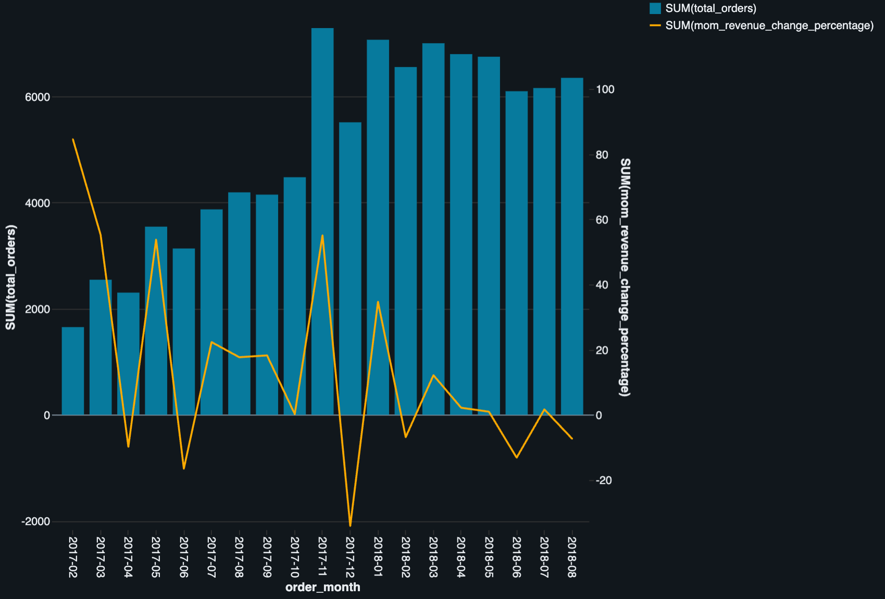
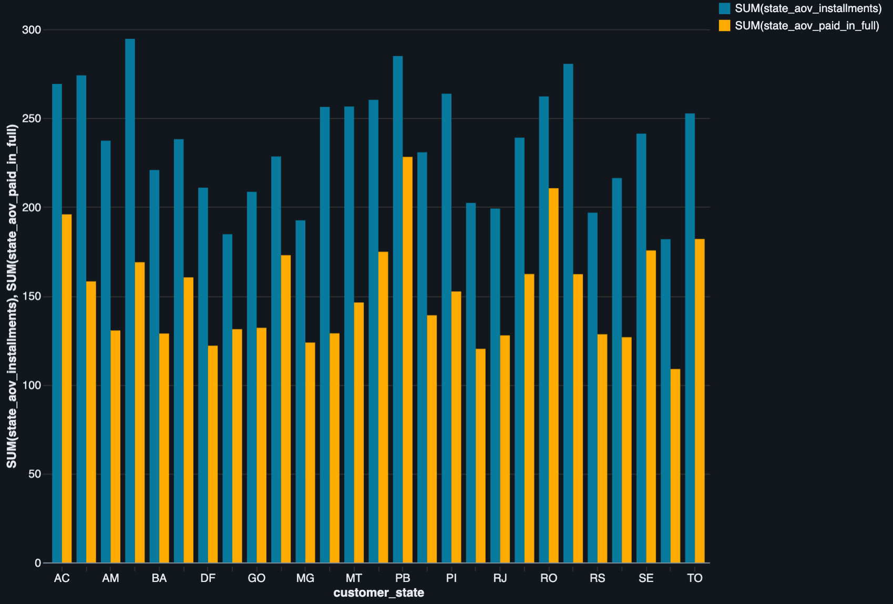
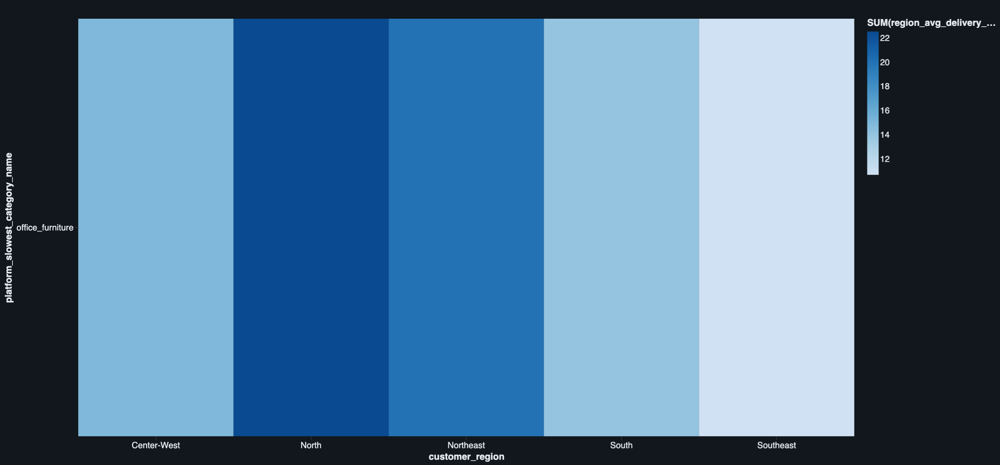

# Olist E-Commerce Analytics Infrastructure Pipeline

👉 **[View Live Interactive dbt Documentation & Data Lineage (DAG)](https://ExcelWhite.github.io/dbt_olist_ecommerce)**

An enterprise-grade Analytics Engineering pipeline built using **dbt (Data Build Tool)** and **Databricks / Spark SQL**. This project matures raw, disconnected marketplace data into production-ready, fully tested Gold Data Marts to power critical business intelligence.

---

## 🏗️ 1. Modern Data Stack Architecture

The pipeline leverages a modular **Bronze ➔ Silver ➔ Gold** multi-layer warehouse design to decouple source dependencies and maximize maintainability.

*   **Bronze:** Clean, direct mapping of raw data source entities with baseline type casting.
*   **Silver:** Heavy cleaning layer applying business logic standardization, order sequencing, and regional seed enrichment.
*   **Gold:** Fully modeled, high-performance analytical aggregates segmented around functional business priorities.

### 📊 Data Lineage & Governance
You can interact with the live code graph in the [Interactive dbt Documentation](https://ExcelWhite.github.io/dbt_olist_ecommerce). The architecture relies on automated quality checks (`data_tests`) ensuring absolute data integrity before analytical runtime.

---

## 📊 2. Core Business Findings & Data Insights

The following metrics and analytics are extracted natively from the validated tables inside the **Gold Marts layer**.

### 📈 Act 1 — Business Overview (`gold_business_overview`)

- **Order Scale & Volatility:** Monthly platform volume expanded steadily to a baseline range of 6,000 to 7,000 orders, though month-over-month revenue velocity shows intense cyclical volatility.
- **Stabilization Trends:** The pipeline captures a massive historical growth surge early in 2017, which rapidly compressed down into a stable, mature, and predictable ecosystem by 2018.



---

### 👥 Act 2 — Customer Behaviour (`gold_customer_behaviour`)

- **Systemic Retention Struggles:** State-level metrics show that low repeat-purchase rates are a systemic challenge across all of Brazil rather than a localized regional issue, with the customer repeat rate consistently hovering around the low 3.12% platform average regardless of geography.
- **The Installment Spending Lift:** The side-by-side bar graph reveals a stark, uniform pattern across every single Brazilian state: the average order value for installment purchases (`state_aov_installments`, shown in blue) consistently and significantly outpaces immediate full payments (`state_aov_paid_in_full`, shown in orange), proving that financing options uniformly catalyze higher ticket spending nationwide.



### 🚚 Act 3 — Operations (`gold_operations`)

- **Geographic Logistics Bottlenecks:** The regional fulfillment heatmap isolates a significant macro-regional divide across Brazil, revealing that while the South and Southeast regions maintain highly efficient, lighter-shaded delivery timelines, the North and Northeast regions experience prolonged, darker-shaded delivery delays.
- **Category-Specific Strain:** Looking at the vertical axis, the data maps these extended shipping durations directly against high-impact sectors like `office_furniture`, proving that specific product categories compound the logistical friction when traveling into more remote geographic territories.



### 🏪 Act 4 — Seller Performance (`gold_sellers_performance`)
*   **Logistical Underperformers:** The model flags **316 highly active sellers** falling drastically behind fulfillment standards with on-time delivery rates below 80%. These merchants represent **$677,825.99** in gross platform value and require active compliance coaching.
*   **The High-Risk Segment:** Our advanced tiering models successfully isolated a volatile group of **113 sellers** who simultaneously rank in the top quartile for overall revenue but the lowest quartile for review scores—making them primary drivers of brand friction.
*   *📊 [Insert 2x2 Quadrant Scatterplot: Revenue vs. Review Score highlighting the Risk Quadrant]*

### 💬 Act 5 — Customer Experience (`gold_customer_experience`)
*   **The Cost of Delays:** The analytical model establishes a clear, quantifiable relationship between operational lag and customer drop-off. Orders that resulted in a critical 1-star review suffered an average shipment delay of **12.36 days past the expected delivery date**.
*   *📊 [Insert Horizontal Bar Chart: Customer Review Scores (1-5 Stars) vs. Average Days of Delivery Delay]*

---

## 🛠️ 3. Engineering & Pipeline Features

To maintain clean code and prevent pipeline-breaking bugs, this project implements standard engineering design patterns:
*   **Jinja Macros:** Centralized complex equations such as safe math division (`calculate_percentage`) and dialect-agnostic timestamp operations (`datediff_days`) to keep the repository completely DRY.
*   **Version-Controlled Seeds:** Managed changing static geographic information completely through Git using `.csv` reference tables.
*   **Automated Quality Assurances:** Implemented both schema-level configurations (`data_tests`) and custom behavioral checks inside the `tests/` directory to automatically catch negative revenue or bad percentage domains.

---

## 📂 4. Repository Blueprint

```text
├── docs/                               # Hosted GitHub Pages artifacts (Live Docs)
├── data/                               # Version-controlled reference seed CSVs
├── macros/                             # Reusable Jinja transformation logic
├── models/
│   ├── staging/                        # BRONZE: Source model maps & freshness tests
│   ├── intermediate/                   # SILVER: Cleansing & sequencing logic
│   └── marts/                          # GOLD: Structured, audited aggregate marts
├── tests/                              # Singular custom business logic tests
├── dbt_project.yml                     # Main project manifest configuration
└── README.md                           # Master documentation hub